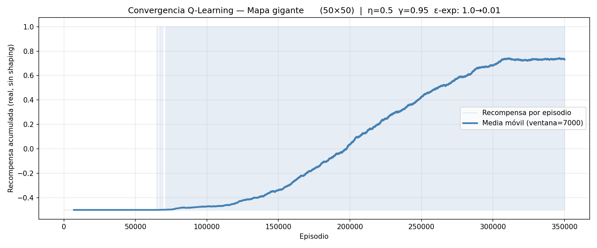

# Robot Labyrinth Navigation with Gymnasium Q-Learning

Este subproyecto entrena un agente Inteligente artificial mediante Aprendizaje por Refuerzo (Reinforcement Learning) en Python, solucionando el problema del "Laberinto" en mapas grid bidimensionales proporcionados por CSV.

## Mejoras Implementadas para Evaluación (Extras)

De acuerdo con la rúbrica de evaluación de la asignatura, se han desarrollado e implementado los siguientes extras:

### 1. Extras relacionados con la API de Gymnasium y Renderizado 

* **Wrapper Personalizado (`BoxToDiscreteObservation`):** Se ha diseñado un Wrapper *customizado* que transforma el espacio de observación continuo 2D (`Box`) en un índice entero 1D (`Discrete`). Esto permite indexar correctamente los estados para Q-Learning y adapta el código dinámicamente a mapas no cuadrados de dispares dimensiones sin romper el patrón estándar de Gymnasium.
* **Manejo Modular de Diversos Entornos:** Se aprovechan los parámetros del constructor `gym.make` para cargar en caliente variados grids CSV (`map1.csv` a `map5.csv`), permitiendo probar al agente desde entornos 12x12 hasta mundos gigantes 50x50, reconfigurándose todo el entorno y renderizado a medida.
* **Auto-Escalado Dinámico del Entorno Visual (Zoom Out):** Intervención manual sobre el `render_mode='human'` accediendo a la clase base de Pygame para forzar un escalado de ventana responsivo basado en el *aspect-ratio* del CSV. Detecta mapas gigantes de Gymnasium y comprime el tamaño del grid y las celdas automáticamente ajustado por código para que quepan holgadamente dentro de las resoluciones de pantalla estándar en vez de desbordarla.
* **Animación Fluida Condicial (60 FPS):** Sustitución del "salto de celda instantáneo" estándar del modo demo por una función algorítmica de animación por interpolación a 60 fps que desplaza visualmente al agente sin modificar el estado 1-tick de Gym, detectando colisiones visuales en recovecos diagonales contra las paredes y trazando un path en "L" suave (Anti-Clipping Pygame).

### 2. Extras de Programación General e IA
* **Potential-Based Reward Shaping mediante BFS:** Para sortear el estancamiento derivado de recompensas escasas (*sparse rewards*), se ha creado un sub-algoritmo de Búsqueda en Anchura (BFS). Previo al inicio, mapea la distancia navegable real de todo el laberinto, premiando los movimientos productivos del agente de forma proporcional a esa distancia y logrando que converja a la solución en tiempos récord eludiendo óptimos locales trampas.
* **Análisis de Convergencia Gráfico (`matplotlib` + `np.convolve`):** Registro de métricas que renderiza, al concluir, la curva de recompensa cruda junto a una línea de Media Móvil (Moving Average) calculada con una convolución tensorial sobre subventanas de episodios. Estos *plots* estadísticos acreditan la validez de los pesos del Q-Learning y se guardan automáticamente por cada experimento.
* **Manejo Robusto de Excepciones y Estados:** Adaptación precisa de transformación de índices para prevenir cruces de límites y desbordamientos (errores de `IndexError`) en los cálculos del entorno y el renderizado interactivo, dotando al código de una sólida fiabilidad sobre laberintos enrevesados.
* **Persistencia de Aprendizaje (Guardar/Cargar Tablas Q):** Uso de serialización masiva de Numpy (`.npy`) al concluir el entrenamiento para preservar el conocimiento tabular óptimo. Esto incluye soporte de CLI `--modo jugar` que esquiva el coste computacional y carga instantáneamente cerebros pre-entrenados listos para resolver.
* **Parametrización CLI (`argparse`):** Soporte de interfaces puras por línea de comandos automatizando distintos perfiles de hiperparámetros de Q-Learning (como el decaimiento *epsilon* progresivo) afines a cada tamaño de mapa mediante el *flag* de consola `--mapa <N>`.

## Descripción General
Utiliza la API moderna **OpenAI Gymnasium** y NumPy para definir y resolver los entornos. El script `practica_gymnasium.py` instancia un mapeado CSV en pantalla y entrena a un agente para que viaje con éxito desde la celda de origen a la celda meta castigando cualquier choque contra paredes. Al finalizar se muestra visualmente usando PyGame la ruta óptima aprendida y se renderiza un gráfico de la convergencia de la recompensa para verificar la fiabilidad del entrenamiento.

### Demostraciones Visuales
Puedes ver al agente en acción navegando por los laberintos a continuación:

**Resolución del Mapa Laberinto (map4.mp4)**


**Resolución del Mapa Gigante (map5.mp4)**




## Algoritmo Utilizado
El núcleo es el algoritmo **Q-Learning Tabular**. 
Debido a la escasez natural de puntos de recompensa ("Sparse Rewards") del laberinto (sólo se cobra al pisar la meta final), aplicamos **Potencial-Based Reward Shaping**:
- Se evalúa la distancia verdadera hacia el objetivo usando Búsqueda en Anchura (**BFS**) antes de comenzar el entrenamiento.
- En cada paso del agente guiamos su conocimiento premiando activamente los desplazamientos que reduzcan esta distancia BFS, acelerando inmensamente el entrenamiento y previniendo que la máquina caiga en "óptimos locales" (bucles oscilantes cerca de paredes que aparentan llevar hacia la meta en distancia lineal/Manhattan pero se hallan realmente tapiadas).

## Archivos y Mapas

- `practica_gymnasium.py`: Core del código de Q-Learning.
- `map1.csv` a `map5.csv`: Diferentes mapas laberínticos discretizados ascendentes en dificultad y tamaño. Map1 es de `10x10`, Map5 es de gigante de `50x50`.
- Imágenes `.png`: Contienen evidencias visuales del progreso del agente al a lo largo de los distintos mapas laberinto (`curva_aprendizaje_mapaX.png`).
- Documentos Técnicos: Detalles de mejoras de diseño y plan de trabajo (`mejoras.md`, `evaluacion.md`).

## Requisitos de Sistema e Instalación
- Python 3.10+
- Bibliotecas PIP necesarias:
  * `gymnasium`
  * `numpy`
  * `pygame`
  * `matplotlib`

Además, se requiere clocar internamente el paquete `gymnasium-csv`.

## Ejecución Básica
Para arrancar el código sobre algún mapa en específico, utilice el parámetro `--mapa` y determine el `--modo`.

Ejemplo para entrenar el gran laberinto 5 (50x50):
```bash
python3 practica_gymnasium.py --mapa 5 --modo entrenar
```

Una vez entrenado (se habrá guardado un `qtable_map5.npy`), puedes cargar directamente el cerebro del agente y ver cómo lo resuelve sin necesidad de reentrenar usando:
```bash
python3 practica_gymnasium.py --mapa 5 --modo jugar
```
